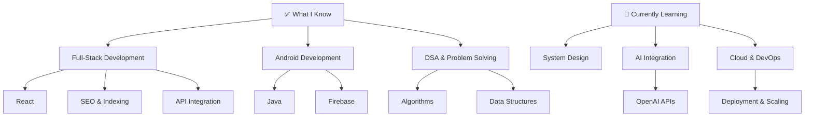

<h1 align="center">Hi there! 👋 I'm Vivek Pawar</h1>

<div align="center">
  
  
  
</div>

<p align="center">
  
</p>

---

## 👨‍💻 About Me

```java
class VivekProfile {
    String location = "India 🇮🇳";
    String education = "Final Year B.Tech CSE (2022–2026)";
    String college = "SVERI’s College of Engineering, Pandharpur";
    String[] interests = {"Full-Stack Development", "Android Development", "AI/ML"};
    String focus = "Building scalable and real-world impactful applications";
    String[] strengths = {"DSA", "Backend Development", "Problem Solving"};
    String currentGoal = "Cracking a top tech internship 🚀";
}
```

- 🔭 Working on **Portfolio Website**
- 🌱 Learning **System Design, AI Integration & Cloud**
- 👯 Open to **Open Source & Collaborations**
- 💬 Ask me about **Java, Android, Firebase, Web Dev**
- ⚡ Fun fact: _I turn ideas into real working products_

---

## 🛠️ Tech Stack & Tools

<div align="center">

### Languages

<p align="center">
  
  
  
  
</p>

### Frontend

<p align="center">
  
  
  
</p>

### Backend

<p align="center">
  
  
</p>

### Mobile

<p align="center">
  
  
</p>

### Databases

<p align="center">
  
  
  
  
  
  
</p>

### Tools & Platforms

<p align="center">
  <a href="https://developer.android.com/studio">
    
  </a>
  <a href="https://code.visualstudio.com/">
    
  </a>
  <a href="https://git-scm.com/">
    
  </a>
  <a href="https://github.com/">
    
  </a>
  <a href="https://www.postman.com/">
    
  </a>
  <a href="https://www.figma.com/">
    
  </a>
  <a href="https://azure.microsoft.com/">
    
  </a>
</p>

</div>

## 🌱 Know & Learning



---

## 📊 GitHub Stats

<div align="center">


</div>

---

## 🏆 Achievements & Activities

- 🎯 Participated in multiple **hackathons & coding competitions**
- 🎤 Managed large-scale college event **Olympus 2K24**
- 💼 Completed **Vocational Training in Web Development**
- 📚 Actively practicing **DSA & Problem Solving**

---

## 🤝 Connect With Me

<div align="center">

[](https://www.linkedin.com/in/vivek-pawar-16548a275/)
[](https://your-portfolio-link.com)
[](mailto:your-email@example.com)

</div>

---

## 💡 Motivation

> I build to solve real problems and create products that people can rely on 🚀

---

<div align="center">

### 🚀 "Code. Build. Test. Find Problems. Solve. Revise."

</div>

---
